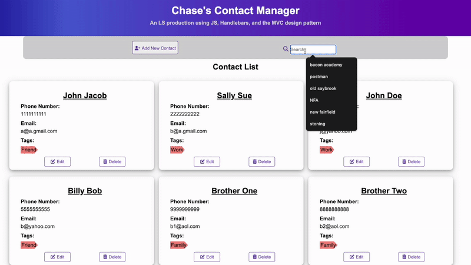
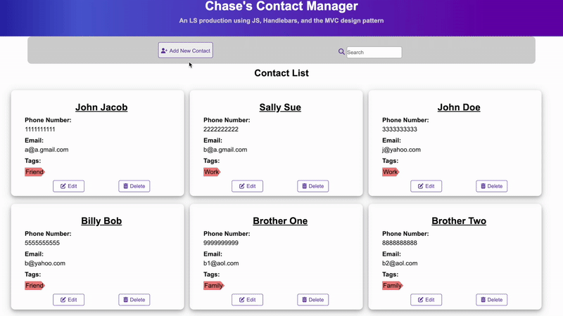
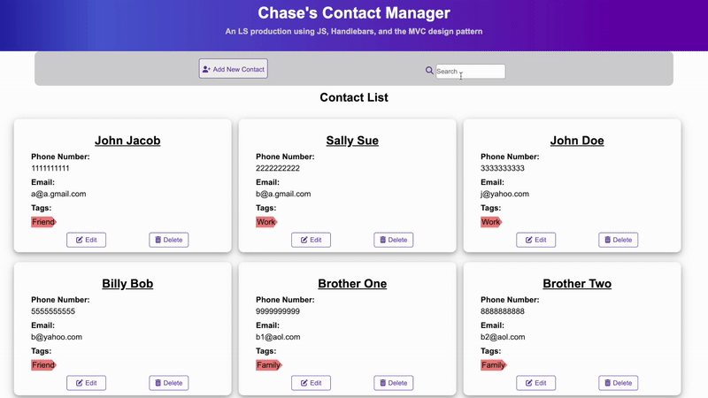
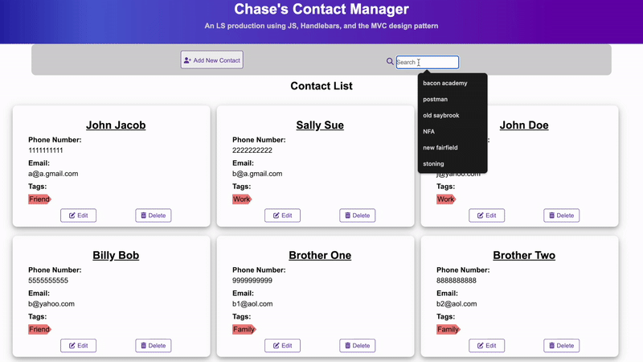
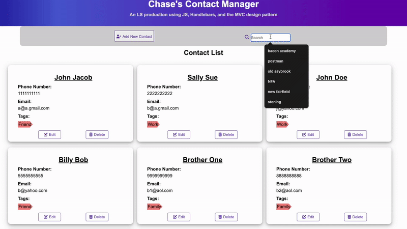
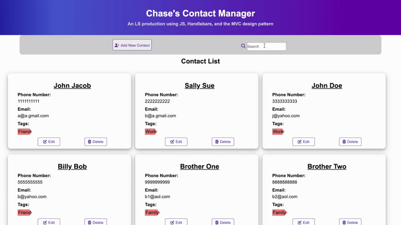

Thank you for taking the time to read this:

Two files of Notice:
- /public/index.html
- /public/javascripts/app.js

I chose to practice the MVC design pattern and 
although I understand I could have split the app.js
file into three separate files, I opted to keep 
everything together in one for my own ease of use.

Features to note:
- The search functionality can search by any component of a
  contact:
    - first or last name
    - phone #
    - email
    - and even tags
- The tags are also filter-able by
   clicking on a given tag
- When a tag filter is applied, the
  search bar is replaced with a button
  that, once clicked, clears the tag filter
- The tags change color upon hovering
  and hovering over a tag for 1.2 seconds
  will give the user an indication that
  (s)he can click to filter
- When using the form, hovering over any
  input field for 3 seconds will give the
  user an indication of what input is expected

## 🚀 App Demo

Delete contact functionality:

Add contact functionality:

Name Search functionality:

Email Search functionality:

Phone number Search functionality:

Filter by Tag functionality:

Tag Hover functionality:

Tag Click functionality:

Lessons learned:
  This was both my first time taking on a project 
this large and using the MVC design pattern. I 
learned a ton, mostly how organization and
separation of concerns can work wonders in breaking
a larger project into manageable bits. The biggest
takeaways were, if possible, 1) to deal with all of 
the data in the Model, 2) keep the View concerned
exclusively with the User Interface and 3) keep the 
Controller for binding and handling the events and 
setting the whole thing into motion.

Although they may never read this, I would like
to thank the previous LS students whose code I
was able to learn from immensely:
Erik, Wayne, Shane, Jason.

Thank you, again.

Respectfully,
Chase
